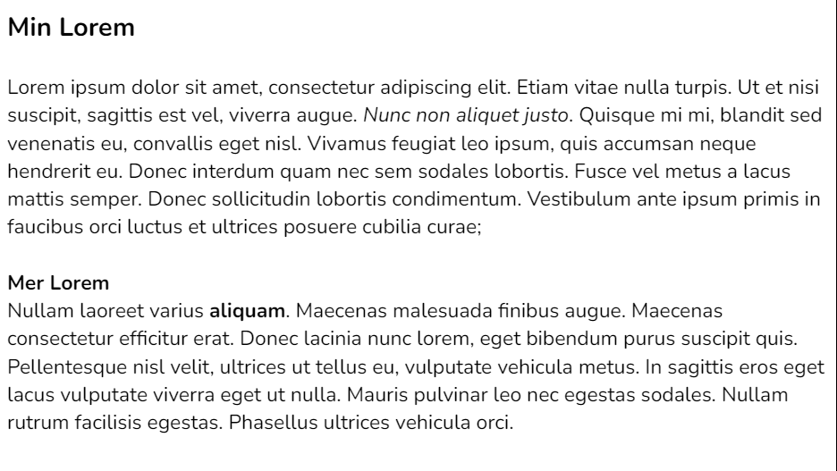

# HTML Bootcamp

HTML är ett enkelt datorspråk som används för att bygga webbsidor. Du använder speciella kommandon kallade "taggar" för att tala om för webbläsaren hur text, bilder och andra saker ska visas på en webbsida. HTML = “HyperText Markup Language”.

## Taggar

Tänk på taggar som speciella ord eller instruktioner i HTML-koden som hjälper webbläsaren att förstå och visa webbsidor korrekt. 

```<taggnamn>Sen kommer min text</taggnamn>```

***start-tagg   text   slut-tagg***

| Tagg | Förklaring |
| p | Detta skapar en paragraf, (block-element) |
| ul | Detta skapar en punktlista, [Exempel](https://www.w3schools.com/html/tryit.asp?filename=tryhtml_lists_unordered) |
| ol | Detta skapar en numrerad lista, [Exempel](https://www.w3schools.com/html/tryit.asp?filename=tryhtml_lists_ordered) |
| li | skapar en punkt i en punktlista ELLER en numrerad punkt i numrerad lista. Används för både ul och ol |
| h1 - h6 | Rubriker |
| strong | Tagg som betonar ett eller flera ord genom att göra dem fetstilta |
| em | Tagg som betonar ett eller flera ord genom att göra dem kursiva |
| img | Bild  |
| a | Länk (anchor-taggen) |
| br | Radbrytning. OBS! Endast starttaggen skrivs |
| main | (semantiskt block-element) |
| article | (semantiskt block-element) |
| section | (semantiskt block-element) |


## Attribut

Attribut är som små instruktioner som du ger till taggar på din webbsida. De hjälper webbläsaren att förstå och visa innehållet på rätt sätt. Till exempel, med attribut kan du säga åt en bildtagg () vilken bild den ska visa (src), eller du kan beskriva vad en länk (<a>) leder till (href).

### Exempel 1

``````

Attributet "src" berättar för webbläsaren var den ska hitta bilden. I detta fall pekar det på en bild med webbadressen "https://i.imgur.com/qDYWGd1.jpeg."

### Exempel 2

```<a href="https://www.ikea.com/se/sv/">IKEA</a>```

Attributet "href" säger åt webbläsaren vilken webbadress länken ska leda till. I detta exempel leder den till IKEAs webbplats på "https://www.ikea.com/se/sv/".

## Bootcamp - Skriv grundläggande HTML

### Övning 1 - Skapa din första "webbsida"

1. Skapa en mapp som du döper till *Webbutveckling*.
2. Öppna din mapp i VS Code.
3. Skapa en fil och döp den enligt formatet *filnamn.html*.
4. Klicka på filen i Explorer-fältet så att du öppnar upp filen i editorn till höger.
5. Skriv ett utropstecken och tryck på tab / enter.
6. Ändra din *title* så att din webbsida får en titel.
7. Spara.
8. Öppna filen i din webbläsare. Testa även att öppna den med *Live Server*-tillägget som du bör ha installerat redan.
9. Klart!

### Övning 2 - Inköpslistan

1. Skriv ut "Inköpslista på ICA" som brödtext.
2. Skapa en inköpslista på allt du behöver för en riktigt bra fredagkväll. Din lista skall vara onumrerad.
3. Lägg till så att endast ordet "ICA" i din text blir en länk till https://www.ica.se/.

### Övning 3 - Kursiv och fet stil

Skapa en webbsida som ser ut ungefär som innehållet i rutan nedan. Notera att det i första stycket finns några kursiva ord och att det i andra stycket finns ett fetstilt ord.



### Övning 4 - Listor

Skapa en webbsida om Stina 9 år. Webbsidan skall innehålla följande:

* En rubrik
* Brödtext om Stina
* En numrerad lista över Stinas top 3 favoritdjur
* En onumrerad list över saker som Stina tycker om att göra
* En tecknad bild av Stinas favoritdjur, bilden måste ha en alt-text

### Övning 5 - Forts. Listor

Vad händer om du lägger till <p>&#128512;</p> i din body? Gå tillbaka till övningen om Stina och lägg till en smiley framför de meningar som börjar med Stina.

Leta upp koden till lite fler emojis och lägg till dem i texten om Stina där de passar och du känner för det.

### Övning 6 - Recept

Skapa en webbsida med valfritt recept. Se till att ha en rubrik med receptets namn, få med en punktlista med ingredienser, en numrerad lista med instruktioner och en bild på hur rätten ser ut!

### Övning 7 - Lista med länkar

Skapa en sida med en rubrik “Mina favoriter” och därunder en punktlista med länkar till några av dina favoritsidor. Använd a-taggen för länkarna. Listan kan vara numrerad eller punktad.

### Övning 8 - Boksida

Skapa en sida om en bok och se till att sidan har bild på boken och info snyggt strukturerat (boktitel, författare, genre, utgivningsår, kort beskrivning av boken och ISBN).

### Övning 9 - Ada Lovelace

Övningen [hittar du här](https://github.com/fu-html-css-fe24/exercise-html-ada-lovelace).

### Övning 10 - Nyhetssidan

Övningen [hittar du här](https://github.com/fu-html-css-fe24/exercise-html-nyhetssidan).

### Övning 11 - Hyllningen

Övningen [hittar du här](https://github.com/fu-html-css-fe24/exercise-html-hyllning).

### Övning 12 - Klona en webbsida

Besök valfri webbsida på webben. Fundera lite kring innehållet på webbsidan, och utifrån dina slutsatser skapar du upp en klon av webbsidan i fråga. Notera att webbsidan inte skall stylas alls, utan endast resultera i ett skal med samma innehåll som på den riktiga webbsidan. Fundera en del kring avvägningarna mellan section, article, main, aside osv. Var passar de in i din klon?


